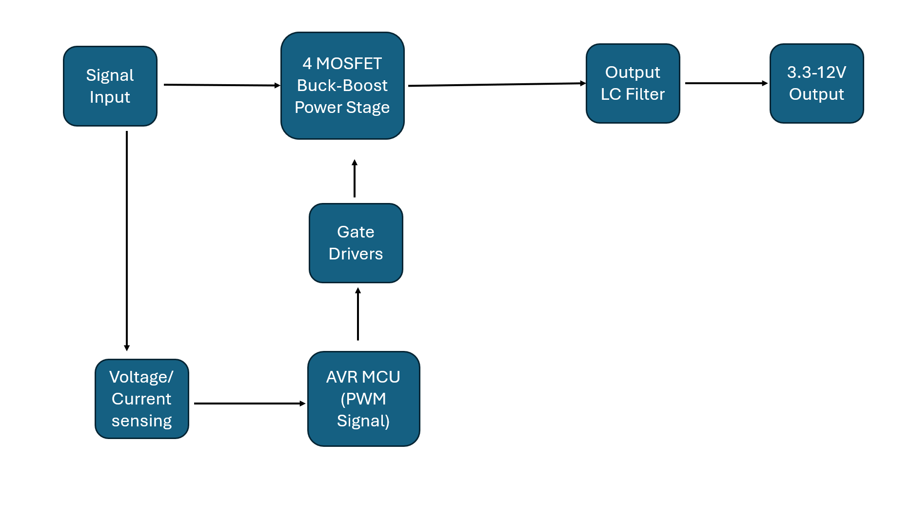
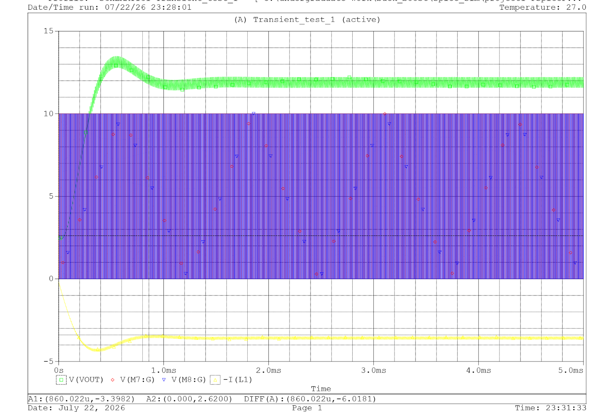

# AVR Controlled Bidirectional DC-DC Converter
## Overview
• Designed the embedded gate-drive architecture using complementary PWM with dead-time insertion, integrating half-bridge gate drivers and an AVR microcontroller to safely control all four MOSFETs while preventing shoot-through.

• Designed and simulated a bidirectional synchronous buck-boost converter using PSpice, performing power stage design, MOSFET gate-drive analysis, and converter validation from schematic through functional verification.

• Engineered a 100 kHz complementary PWM control architecture with dead-time insertion for a four-MOSFET synchronous converter, validating gate-drive timing and switching behavior using circuit simulation.

# Specifications
<table>
  <thead>
    <tr>
      <th>Parameter</th>
      <th>Specification</th>
    </tr>
  </thead>
  <tbody>
    <tr>
      <td><strong>Input Voltage</strong></td>
      <td>3.3–5 V</td>
    </tr>
    <tr>
      <td><strong>Boost Output</strong></td>
      <td>12 V</td>
      <td><strong>PWM Frequency</strong></td>
      <td>100 kHz</td>
    </tr>
    <tr>
      <td><strong>Inductor</strong></td>
      <td>122 µH</td>
    </tr>
    <tr>
      <td><strong>Peak Output Current</strong></td>
      <td>4 A</td>
    </tr>
    <tr>
      <td><strong>Simulated Efficiency</strong></td>
      <td>96%</td>
    </tr>
    <tr>
      <td><strong>Settling Time</strong></td>
      <td>1.0 ms</td>
    </tr>
    <tr>
      <td><strong>Controller</strong></td>
      <td>ATmega/AVR</td>
    </tr>
    <tr>
      <td><strong>Simulation Suite</strong></td>
      <td>PSpice</td>
    </tr>
  </tbody>
</table>

## Block Diagram

## Control Strategy
The AVR generates complementary 100 kHz PWM signals with programmable dead time. These PWM signals drive two half-bridge gate-driver ICs powered from a dedicated 10 V supply. The gate drivers switch the four-MOSFET synchronous buck-boost stage while preventing shoot-through. Output voltage is regulated through duty-cycle control, with energy transferred through a 122 µH inductor.

## PCB Design
Optimized for a compact 30x32mm footprint to minimize fabrication time and material costs. To ensure signal integrity, the high-voltage switching paths were isolated from the sensitive gate-drive architecture and AVR microcontroller using strategic multi-layer routing, localized ground planes, and dedicated physical keep-out zones to mitigate EMI. 
 

## Simulation Results
Stabilizes in >1.0mS creating a stable 12V boosted output. This has a high efficiency of up to 96%.

 

## Measured Results

## Future Improvements

